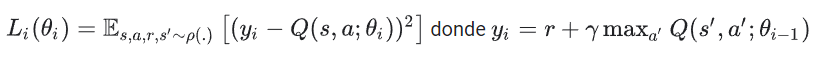

<!--
_header: ''
_footer:  Esta obra está bajo una [licencia de Creative Commons Reconocimiento-NoComercial-CompartirIgual 4.0 Internacional](http://creativecommons.org/licenses/by-nc-sa/4.0/). Icono diseñado por Flaticon
-->

# Aprendizaje por refuerzo y técnicas generativas.

Deep Q Network (DQN)

---

<!-- _class: section -->
# Introducción a Deep Q-learning

---

## Introducción

Visto anteriormente el Aprendizaje por refuerzo, e introducido a este campo a través de una de sus técnicas más populares: el *Q-learning*. Y además, se han establecido las bases hablando de procesos de decisión de Markov, políticas y funciones de valor.

En este apartado extenderemos las técnicas de ***Q-Learning*** clásico incorporando el uso de *redes neuronales*, dando pie a la evolución a los modelos de ***Deep Q Network***.

Si quieres ahondar en conceptos de Deep Learning, algunos recursos recomendados:

- https://www.coursera.org/learn/neural-networks-deep-learning
- https://www.tensorflow.org/guide/core/mlp_core
- https://www.tensorflow.org/agents/tutorials/0_intro_rl?hl=es-419

---

## Un poco de historia

En ***2015***, *DeepMind*, siendo ya parte de Google, presentó un avance en el campo del aprendizaje por refuerzo profundo con la introducción de ***Deep Q Network (DQN)***, marcando el comienzo del campo conocido hoy como *Deep Reinforcement Learning*.

***DQN*** cambia la forma en que se aborda el aprendizaje automático en entornos de toma de decisiones secuenciales. 
   - En lugar de procesar datos estáticos (imágenes o texto), el aprendizaje por refuerzo implica aprender a tomar decisiones secuenciales mientras se maximiza una recompensa acumulativa.
   - ***DQN*** se lanzó en un videojuego de ***Atari***, utilizando solo píxeles de la pantalla y retroalimentación de recompensa sencilla, logrando superar el rendimiento de los "expertos/frikies" en varios juegos, incluidos títulos icónicos como Breakout, Space Invaders y Pong. 
   - La capacidad de ***DQN*** radica aprender directamente de la experiencia, o más bien del escenario que se crea en cada instantem, y tomar decisiones óptimas en entornos complejos.
   - Todo esto allanó el camino para aplicaciones en campos como la robótica, los sistemas de control, la gestión de inventario, los vehículos autónomos y más. 
---

## Q-Learning vs. Deep Q-Learning

     

- En ***Q-Learning*** usamos la tablas de estados y acciones, o Q-valores.
- En ***Deep Q-Learning*** utilizamos una red neuronal que aproxima o minimiza la función que aproxima esos Q-valores.

---

## Q-Learning vs. Deep Q-Learning

El uso de ***redes neuronales*** tiene varios propósitos importantes en comparación con el enfoque tradicional de Q-Learning:

 - ***Aproximación de la función Q***: En Q-Learning la tabla que almacena los Q-valores de cada par estado-acción posible, aciendo dependiente de la complejidad del problema. Una ***red neuronal*** permite aproximar la función Q, lo que significa que ***cedemos*** a la red el aprender una representación de la función Q, como si generase su propia Q-tabla.

 - ***Generalización y abstracción***: Las redes neuronales por definición buscan generalizar a partir de ejemplos y extraer características relevantes de los datos de entrada.

 - ***Escalabilidad***: en Q-Learning vemos limitadas nuestras acciones por como de compleja podamos generar nuestra Q-tabla, las redes neuronales permiten manejar datos de alta dimensionalidad y extraer características relevantes para la toma de decisiones.

 - ***Aprendizaje de representaciones jerárquicas***: aprenden representaciones jerárquicas de los datos, lo que les permite capturar características tanto a nivel bajo (como bordes y texturas en una imagen) como a nivel alto (como objetos y patrones).

---

## El agente y su entorno

     

El ***agente*** y el ***entorno*** interactúan continuamente entre sí, cada iteración el agente toma una acción en el entorno donde varía la observación actual, y recibe una recompensa y la siguiente observación desde el entorno. 

El objetivo es mejorar el agente en cada iteración para maximizar la suma de recompensas.

---

## Deep Q-Learning

***Q-Learning*** funciona muy bien cuando el entorno es simple y la función Q(s,a) se puede representar como una tabla o matriz de valores. 

**Deep Q-Network o DQN** combina el algoritmo Q-learning con redes neuronales.
 - usa una red neuronal para aproximar la ***función Q*** (En realidad, utiliza dos redes neuronales para estabilizar el proceso de aprendizaje).
 - la red neuronal principal (main Neural Network), representada por los parámetros ***θ***, se utiliza para estimar los ***valores-Q*** del estado ***s*** y acción a actuales: ***Q(s, a; θ)***. 
 - la red neuronal objetivo (target Neural Network), parametrizada por ***θ´***, tendrá la misma arquitectura que la red principal pero se usará para aproximar los ***valores-Q*** del siguiente estado ***s´*** y la siguiente acción ***a´***.

---

## Deep Q-Learning, entrenamiento

El entrenamiento ocurre solo ***en la red principal*** y no en la objetivo. 

La ***red objetivo se congela*** (sus parámetros se congelan) durante varias iteraciones (normalmente alrededor de 10000).

Despues de las iteraciones predefinidas, ***los parámetros de la red principal se copian*** a la ***red objetivo***, transmitiendo así el aprendizaje de una a otra, haciendo que las estimaciones calculadas por la red objetivo sean más precisas.

---

## Ecuación de Bellman en DQN

     

La función de Bellman cambia para adaptarse a las redes neuronales y a su vez, necesitamos de una ***función de pérdida ***(***loss function***) definida como el cuadrado de la diferencia entre ambos lados de la ec. de Bellman.

     

Ésta ***loss function*** será la que minimizaremos usando el algoritmo de descenso de gradientes, viene definida dentro de las librerías de ***TensorFlow*** o ***PyTorch***.

---

## El entorno de Cartpole

     
<aside><b>Cartpole</b> es uno de los problemas de aprendizaje de refuerzo <b>clásicos</b> ("Hola, mundo!"). Un poste está sujeto a un carro, que puede moverse a lo largo de una pista sin fricción. El poste comienza en posición vertical y el objetivo es evitar que se caiga controlando el carro.

La observación del entorno es un vector 4D representa la posición y la velocidad del carro, y el ángulo y la velocidad angular del polo. El agente puede controlar el sistema mediante 2 acciones, empujar a la derecha (1) o izquierda (-1).
</aside>

Las claves del juego vienen dadas por:
- La recompensa de dá según pasa el tiempo y el palo permanece vertical.
- El juego termina cuando el poste se inclina por encima de algún límite o el carro se mueve fuera de los bordes del mundo.
- El objetivo del agente es aprender a maximizar la suma de recompensas. 

["Tutorial DQN en Cartpole de Tensorflow"](https://github.com/tensorflow/agents/blob/master/docs/tutorials/1_dqn_tutorial.ipynb)

---

Como ya hemos vemos, el Q-learning tradicional es poco práctica cuando el problema escala.
Usando ***DQN*** formamos un aproximador de función Q, tal como una red neuronal con parámetros &theta;, para estimar los valores de Q, es decir, Q(s,a;&theta;)&asymp; Q*(s,a).
Es decir, puede hacerse mediante la minimización de la siguiente pérdida en cada paso $i$:

     

$Y_i$ se llama a la diferencia temporal (TD) destino, e $Y_i - Q$ al error en TD.
$p$ representa la distribución del comportamientos, expresada en transiciones $(s,a,r,s')$

---

## Temario

1. Bloque I: Bases de datos avanzadas
   1. Introducción a las bases de datos NoSQL (tipos de bases de datos No-SQL)
   2. Comparativa entre bases de datos relacionales vs bases de datos NoSQL
   3. Tipos de características de bases de datos NoSQL (Bases de datos basadas en ficheros)
2. Bloque II: Gobernanza de datos
   1. Gobernanza de datos y data provenance
   2. Curación y limpieza de datos
   3. Transformación y serialización de datos
3. Bloque III: Bases de datos NoSQL
   1. Mongodb - bases de datos basadas en documentos
   2. Cassandra - bases de datos basadas en columnas (key-value)
   3. Neo4j - bases de datos basadas en grafos
4. Bloque IV: Data streaming
   1. Programación contra bases de datos
   2. Motores de data streaming 

---

## Horario

---

## Evaluación progresiva

Prácticas (40%)
- En grupos
- Evaluación en el aula

Examen final (60%)
- Nota mínima de 4
- Todo el temario
- Viernes 9 de junio de 2023 a las 10:00 en el aula 1302

Será necesario alcanzar una nota total >= 5 para aprobar la asignatura.

---

## Evaluación prueba global

Prueba escrita el **viernes 9 de junio de 2023 a las 10:00** en el aula **1302** incluyendo preguntas teórico-prácticas de todo el temario de la asignatura.

Es necesaro obtener una nota mínima de 4 sobre 10.

Para aprobar sin haber seguido la evaluación progresiva será necesario obtener una nota total >= 5 (la prueba global cuenta un 60% del total de la nota, por lo que sacar un 5 en esta prueba no equivale a aprobar la asignatura).

---

## Convocatoria extraordinaria

Prueba escrita el **jueves 6 de julio de 2023 a las 10:00** incluyendo preguntas teórico-prácticas de todo el temario de la asignatura.

Es obligatorio alcanzar una nota mínima de 5 puntos sobre 10.

---
 

## Recursos didácticos

1. **Moodle de la asignatura.**
2. Data Governance: How to Design, Deploy, and Sustain an Effective Data Governance Program (English Edition) 2o Edición. John Ladley.
3. Data Provenance A Complete Guide - 2020 Edition (English Edition). Gerardus Blokdyk
4. Pandas 1.x Cookbook: Practical recipes for scientific computing, time series analysis, and  exploratory data analysis using Python, 2nd Edition (English Edition). Matt Harrison; Theodore Petrou
5. SQL & NoSQL Databases: A Comprehensive Introduction To Relational (SQL) And Non-relational (NoSQL) Databases (English Edition). Danniella Hardin
6. SQL & NoSQL Databases: Models, Languages, Consistency Options and Architectures for Big Data Management (English Edition). Andreas Meier; Michael Kaufmann
7. Stream Processing with Apache Flink: Fundamentals, Implementation, and Operation of Streaming Applications. Fabian Hueske, Vasiliki Kalavri

