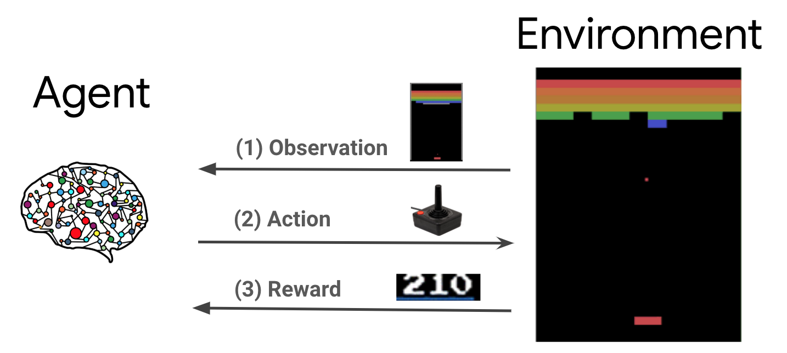

<!--
_header: ''
_footer: <br>Esta obra está bajo una [licencia de Creative Commons Reconocimiento-NoComercial-CompartirIgual 4.0 Internacional](http://creativecommons.org/licenses/by-nc-sa/4.0/). Icono diseñado por Flaticon
-->

# Aprendizaje por refuerzo y técnicas generativas.

Deep Q Network (DQN)

---

<!-- _class: section -->
# Introducción a Deep Q-learning


---


## Introducción

Previamente en "Aprendizaje por refuerzo", se ha introducido una de sus técnicas más populares: el *Q-learning*. Y además, se han establecido las bases hablando de procesos de decisión de Markov, políticas y funciones de valor.

En este apartado extenderemos las técnicas de ***Q-Learning*** clásico incorporando el uso de *redes neuronales*, dando pie a la evolución a los modelos de ***Deep Q Network***.

Algunos conocimientos de Deep Learning y recursos recomendados de interes:

- https://www.coursera.org/learn/neural-networks-deep-learning
- https://www.tensorflow.org/guide/core/mlp_core
- https://www.tensorflow.org/agents/tutorials/0_intro_rl?hl=es-419


---

<style scoped>
li { font-size: 0.7rem; }
p { font-size: 0.9rem; }
</style>

## Un poco de historia

En ***2015***, *DeepMind*, siendo ya parte de Google, presentó un avance en el campo del aprendizaje por refuerzo profundo con la introducción de ***Deep Q Network (DQN)***, marcando el comienzo del campo conocido hoy como *Deep Reinforcement Learning*.

***DQN*** cambia la forma en que se aborda el aprendizaje automático en entornos de toma de decisiones secuenciales. 
   - En lugar de procesar datos estáticos (imágenes o texto), el aprendizaje por refuerzo implica aprender a tomar decisiones secuenciales mientras se maximiza una recompensa acumulativa.
   - ***DQN*** se lanzó en un videojuego de ***Atari***, utilizando solo píxeles de la pantalla y retroalimentación de recompensa sencilla, logrando superar el rendimiento de los "expertos/frikies" en varios juegos, incluidos títulos icónicos como Breakout, Space Invaders y Pong. 
   - La capacidad de ***DQN*** radica aprender directamente de la experiencia, o más bien del escenario que se crea en cada instantem, y tomar decisiones óptimas en entornos complejos.
   - Todo esto allanó el camino para aplicaciones en campos como la robótica, los sistemas de control, la gestión de inventario, los vehículos autónomos y más. 
---

<style scoped>
li { font-size: 0.7rem; }
p { font-size: 0.7rem; }
</style>

## Q-Learning vs. Deep Q-Learning


<p align="center" width="100%">
     
</p>

- En ***Q-Learning*** usamos la tablas de estados y acciones, o Q-valores.
- En ***Deep Q-Learning*** utilizamos una red neuronal que aproxima o minimiza la función que aproxima esos Q-valores.

---


<style scoped>
li { font-size: 0.45rem; }
p { font-size: 0.8rem; }
</style>

## Q-Learning vs. Deep Q-Learning

El uso de ***redes neuronales*** tiene varios propósitos importantes en comparación con el enfoque tradicional de Q-Learning:

 - ***Aproximación de la función Q***: En Q-Learning la tabla que almacena los Q-valores de cada par estado-acción posible, haciendo dependiente de la complejidad del problema. Una ***red neuronal*** permite aproximar la función Q, lo que significa que ***cedemos*** a la red el aprender una representación de la función Q, como si generase su propia Q-tabla.

 - ***Generalización y abstracción***: Las redes neuronales por definición buscan generalizar a partir de ejemplos y extraer características relevantes de los datos de entrada.

 - ***Escalabilidad***: en Q-Learning vemos limitadas nuestras acciones por como de compleja podamos generar nuestra Q-tabla, las redes neuronales permiten manejar datos de alta dimensionalidad y extraer características relevantes para la toma de decisiones.

 - ***Aprendizaje de representaciones jerárquicas***: aprenden representaciones jerárquicas de los datos, lo que les permite capturar características tanto a nivel bajo (como bordes y texturas en una imagen) como a nivel alto (como objetos y patrones).


---


<style scoped>
li { font-size: 0.8rem; }
p { font-size: 0.8rem; }
</style>

## El agente y su entorno

<p align="center" width="100%">
     
</p>

El ***agente*** y el ***entorno*** interactúan continuamente entre sí, cada iteración el agente toma una acción en el entorno donde varía la observación actual, y recibe una recompensa y la siguiente observación desde el entorno. 

El objetivo es mejorar el agente en cada iteración para maximizar la suma de recompensas.


---


## Deep Q-Learning


***Q-Learning*** funciona muy bien cuando el entorno es simple y la función Q(s,a) se puede representar como una tabla o matriz de valores. 

**Deep Q-Network o DQN** combina el algoritmo Q-learning con redes neuronales.
 - usa una red neuronal para aproximar la ***función Q*** (En realidad, utiliza dos redes neuronales para estabilizar el proceso de aprendizaje).
 - la red neuronal principal (main Neural Network), representada por los parámetros ***θ***, se utiliza para estimar los ***valores-Q*** del estado ***s*** y acción ***a*** actuales: ***Q(s, a; θ)***. 
 - la red neuronal objetivo (target Neural Network), parametrizada por ***θ´***, tendrá la misma arquitectura que la red principal pero se usará para aproximar los ***valores-Q*** del siguiente estado ***s´*** y la siguiente acción ***a´***.

---

## Deep Q-Learning, entrenamiento

El entrenamiento ocurre solo ***en la red principal*** y no en la objetivo. 

La ***red objetivo se congela*** (sus parámetros se congelan) durante varias iteraciones (normalmente alrededor de 2000).

Despues de las iteraciones predefinidas, ***los parámetros de la red principal se copian*** a la ***red objetivo***, transmitiendo así el aprendizaje de una a otra, haciendo que las estimaciones calculadas por la red objetivo sean más precisas.

---

## Ecuación de Bellman en DQN

<p align="center" width="100%">
     
</p>

La función de Bellman cambia para adaptarse a las redes neuronales y a su vez, necesitamos de una ***función de pérdida*** (***loss function***) definida como el cuadrado de la diferencia entre ambos lados de la ec. de Bellman.

<p align="center" width="100%">
     
</p>

Ésta ***loss function*** será la que minimizaremos usando el algoritmo de descenso de gradientes, viene definida dentro de las librerías de ***TensorFlow*** o ***PyTorch***.

---


<style scoped>
li { font-size: 0.8rem; }
p { font-size: 0.8rem; }
div.noticia {
  width: 100%;
  font-size: 0.8rem; 
}

div.noticia img.izquierda {
  float: right;
  margin-right: 15px;
}
div.reset {
  clear: both;
}
</style>

## El entorno de Cartpole


<div class="noticia">
     
<aside><b>Cartpole</b> es uno de los problemas de aprendizaje de refuerzo <b>clásicos</b> ("Hola, mundo!"). Un poste está sujeto a un carro, que puede moverse a lo largo de una pista sin fricción. El poste comienza en posición vertical y el objetivo es evitar que se caiga controlando el carro.

La observación del entorno es un vector 4D representa la posición y la velocidad del carro, y el ángulo y la velocidad angular del polo. El agente puede controlar el sistema mediante 2 acciones, empujar a la derecha (1) o izquierda (-1).
</aside>
</div>

Las claves del juego vienen dadas por:
- La recompensa de dá según pasa el tiempo y el palo permanece vertical.
- El juego termina cuando el poste se inclina por encima de algún límite o el carro se mueve fuera de los bordes del mundo.
- El objetivo del agente es aprender a maximizar la suma de recompensas. 

["Tutorial DQN de Cartpole en Tensorflow"](https://github.com/tensorflow/agents/blob/master/docs/tutorials/1_dqn_tutorial.ipynb)

["Tutorial DQN de Cartpole en Pytorch"](https://colab.research.google.com/drive/1w5xFX2wJvtuVbcrDHny7YPcTdGqMOqMu#offline=true&sandboxMode=true)


---

## Ejemplo de DQN: Creación de las redes neuronales

```python
class DQN(tf.keras.Model):
  """Perceptron multicapa de 2 capas de 32 y una se salida"""
  def __init__(self):
    super(DQN, self).__init__()
    self.dense1 = tf.keras.layers.Dense(32, activation="relu")
    self.dense2 = tf.keras.layers.Dense(32, activation="relu")
    self.dense3 = tf.keras.layers.Dense(num_actions, dtype=tf.float32) # No activation
    
  def call(self, x):
    """Construcción de las capas"""
    x = self.dense1(x)
    x = self.dense2(x)
    return self.dense3(x)

main_nn = DQN() # Red principal
target_nn = DQN() # Red objetivo

optimizer = tf.keras.optimizers.Adam(1e-4) #Optimizados Adam
mse = tf.keras.losses.MeanSquaredError() #Loss function MSE
```
---


## Ejemplo de DQN: Creación del buffer para la experiencia

```python
class ReplayBuffer(object):
  """Experience replay buffer that samples uniformly."""
  def __init__(self, size):
    self.buffer = deque(maxlen=size)

  def add(self, state, action, reward, next_state, done):
    self.buffer.append((state, action, reward, next_state, done))

  def __len__(self):
    return len(self.buffer)

  def sample(self, num_samples):
    states, actions, rewards, next_states, dones = [], [], [], [], []
    idx = np.random.choice(len(self.buffer), num_samples)
    for i in idx:
      elem = self.buffer[i]
      state, action, reward, next_state, done = elem
      states.append(np.array(state, copy=False))
      actions.append(np.array(action, copy=False))
      rewards.append(reward)
      next_states.append(np.array(next_state, copy=False))
      dones.append(done)
    states = np.array(states)
    actions = np.array(actions)
    rewards = np.array(rewards, dtype=np.float32)
    next_states = np.array(next_states)
    dones = np.array(dones, dtype=np.float32)
    return states, actions, rewards, next_states, dones
```
---


## Ejemplo de DQN: función auxiliar para ejecutar la política ε-voraz

```python
def select_epsilon_greedy_action(state, epsilon):
  """Acción aleatoria con probabilidad menor que epsilon, en otro caso la mejor."""
  result = tf.random.uniform((1,))
  if result < epsilon:
    return env.action_space.sample() # Elegimos una acción aleatória
  else:
    return tf.argmax(main_nn(state)[0]).numpy() # Elección de acción Greedy.

@tf.function # Configuración de cada iteración de entrenamiento
def train_step(states, actions, rewards, next_states, dones):
  # Calculo de los objetivos (segunda red)
  next_qs = target_nn(next_states)
  max_next_qs = tf.reduce_max(next_qs, axis=-1)
  target = rewards + (1. - dones) * discount * max_next_qs
  with tf.GradientTape() as tape:
    qs = main_nn(states)
    action_masks = tf.one_hot(actions, num_actions)
    masked_qs = tf.reduce_sum(action_masks * qs, axis=-1)
    loss = mse(target, masked_qs)
  grads = tape.gradient(loss, main_nn.trainable_variables)
  optimizer.apply_gradients(zip(grads, main_nn.trainable_variables))
  return loss
```
---

## Ejemplo de DQN: función auxiliar para ejecutar la política ε-voraz

Con el cálculo de la ***política ε-voraz***, se definen los hiperparámetros y empezaremos a entrenar el algoritmo. 

1. Utilizamos el ***cálculo ε-voraz*** para jugar al juego y recoger datos para aprender. 
2. Después de un juego, llamamos a la función que entrena la red neuronal. 
3. Cada ***2000 epochs***, copiaremos los pesos de la red neuronal principal a la red neuronal objetivo. 
4. También reduciremos el valor de epsilon (ε), para empezar con un valor de exploración alto y bajarlo poco a poco. Así, veremos cómo el algoritmo empieza a aprender a jugar al juego y la recompensa obtenida jugando al juego irá mejorando poco a poco.
   
---

## Ejemplo de DQN: Hyperparámetros y entrenamiento

```python
# Hyperparámetros
num_episodes = 1000
epsilon = 1.0
batch_size = 32
discount = 0.99
buffer = ReplayBuffer(100000)
cur_frame = 0

# Comienzo del entrenamiento. Jugamos una vez y entrenamos con un batch.
last_100_ep_rewards = []
for episode in range(num_episodes+1):
  state = env.reset() #reseteo del ecosistema
  ep_reward, done = 0, False
  while not done:
    state_in = tf.expand_dims(state, axis=0)
    action = select_epsilon_greedy_action(state_in, epsilon)
    next_state, reward, done, info = env.step(action)
    ep_reward += reward
    # Guardamos el juego.
    buffer.add(state, action, reward, next_state, done)
    state = next_state
    cur_frame += 1
    # CoCopiamos los pesos de main_nn a target_nn.
    if cur_frame % 2000 == 0:
      target_nn.set_weights(main_nn.get_weights())
```

---

## Ejemplo de DQN: Hyperparámetros y entrenamiento

```python
    # Entrenamiento de la red neuronal.
    if len(buffer) >= batch_size:
      states, actions, rewards, next_states, dones = buffer.sample(batch_size)
      loss = train_step(states, actions, rewards, next_states, dones)
  
  if episode < 950:
    epsilon -= 0.001

  if len(last_100_ep_rewards) == 100:
    last_100_ep_rewards = last_100_ep_rewards[1:]
  last_100_ep_rewards.append(ep_reward)
    
  if episode % 50 == 0:
    print(f'Episode {episode}/{num_episodes}. Epsilon: {epsilon:.3f}. '
          f'Reward in last 100 episodes: {np.mean(last_100_ep_rewards):.3f}')
env.close()
```

---

<!-- _class: section -->
# Double Deep Q-Network y Dueling Deep Q-Network

---

## Algoritmos avanzados de DQN

El algoritmo de DQN, es capaz de solucionar problemas complejos, pero también tiene deficiencias.

Por ello, aparecen algoritmos aportando mejoras como lo son ***Double Deep Q-Network*** (Double DQN) y ***Dueling Deep Q-Network*** (Dueling DQN). 

Ambos modelos tienen la capacidad para ***mejorar la estabilidad y eficacia del aprendizaje*** por refuerzo en entornos desafiantes. 


---

## Double Deep Q-Network

***Double DQN*** surge para mitigar el sesgo que ***comete algoritmo DQN*** es que sobreestima las recompensas reales; es decir, los valores-Q que aprende pisan que va a obtener una recompensa mayor de la que tendrá en realidad.

Double DQN propone separar la selección y la evaluación de una acción en dos pasos, usando ***dos redes neuronales*** para estimar los valores de acción y actualizarlas de manera independiente.
<p align="center" width="100%">
     
</p>

Primero la red neuronal principal ***θ*** decide cuál es la mejor acción entre todas las posibles, y luego la ***red objetivo*** evalúa esa acción para conocer su ***valor-Q***.


---

## Dueling Deep Q-Network

Este algoritmo divide los ***valores-Q en dos partes distintas***, la función de valor (value function) ***V(s)*** y la función de ventaja (advantage function) ***A(s, a)***.

- La ***función de valor V(s)*** nos dice cuánta recompensa obtendremos desde el estado s.
- La ***función de ventaja A(s, a)*** nos dice cuánto mejor es una acción respecto a las demás.
- Combinando el valor ***V*** y la ventaja ***A*** de cada acción, obtenemos los valores-Q:
  
<p align="center" width="100%">
     
</p>

---


## Dueling Deep Q-Network

***Dueling DQN*** divide la capa final de la red en dos:
1. Estima el valor del estado s (V(s)) 
2. Estima la ventaja de cada acción a (A(s, a))

La unión de ambas partes estima los valores-Q.

  
<p align="center" width="100%">
     
</p>

---

## Dueling Deep Q-Network: Código

```python
class DuelingDQN(tf.keras.Model):
  """CNN para juegos de Atari."""
  def __init__(self, num_actions):
    super(DuelingDQN, self).__init__()
    self.conv1 = tf.keras.layers.Conv2D(
        filters=32, kernel_size=8, strides=4, activation="relu",
    )
    self.conv2 = tf.keras.layers.Conv2D(
        filters=64, kernel_size=4, strides=2, activation="relu",
    )
    self.conv3 = tf.keras.layers.Conv2D(
        filters=64, kernel_size=3, strides=1, activation="relu",
    )
    self.flatten = tf.keras.layers.Flatten()
    self.dense1 = tf.keras.layers.Dense(units=512, activation="relu")
    self.V = tf.keras.layers.Dense(1)
    self.A = tf.kears.layers.Dense(num_actions)
```

---

## Dueling Deep Q-Network: Código

```python
  @tf.function
  def call(self, states):
    """Forward pass of the neural network with some inputs."""
    x = self.conv1(states)
    x = self.conv2(x)
    x = self.conv3(x)
    x = self.flatten(x)
    x = self.dense1(x)
    V = self.V(x)
    A = self.A(x)
    Q = V + tf.subtract(A, tf.reduce_mean(A, axis=1, keepdims=True))
    return Q
```
[Código en tensorflow](https://colab.research.google.com/drive/16RjttswTuAjgqVV2jA-ioY2xVEQqIcQE#offline=true&sandboxMode=true)
[Código en Pytorch](https://colab.research.google.com/drive/1EW7i4Jo_u2VbZAls7CVON_bKfFyKqKIn#offline=true&sandboxMode=true)

---

## Dueling Deep Q-Network: Código entrenamiento

```python
@tf.function
def train_step(states, actions, rewards, next_states, dones):
  # Selección de la proxima mejor acción con main_nn.
  next_qs_main = main_nn(next_states)
  next_qs_argmax = tf.argmax(next_qs_main, axis=-1)
  next_action_mask = tf.one_hot(next_qs_argmax, num_actions)
  
  # Evaluamos la mejor acción con target_nn para sacar el Q-value.
  next_qs_target = target_nn(next_states)
  masked_next_qs = tf.reduce_sum(next_action_mask * next_qs_target, axis=-1)
  
  # Creamos el objetivo usando la recompensa y el descuento del proximo Q-value.
  target = rewards + (1. - dones) * discount * masked_next_qs
  with tf.GradientTape() as tape:
    qs = main_nn(states) # Q-values del estado actual.
    action_mask = tf.one_hot(actions, num_actions)
    masked_qs = tf.reduce_sum(action_mask * qs, axis=-1)
    loss = loss_fn(target, masked_qs)
    
  grads = tape.gradient(loss, main_nn.trainable_variables)
  optimizer.apply_gradients(zip(grads, main_nn.trainable_variables))
  return loss
```

---
<style scoped>
p { font-size: 0.7rem; }
table {font-size: 0.7rem;}
li{font-size: 0.7rem;}

div.noticia {
  width: 100%;
  height: 60%;
  font-size: 0.8rem; 
  margin-top:40px;
}

div.noticia img.izquierda {
  float: left;
  margin-right: 70px;
  margin-left: 35px;
}
div.reset {
  clear: both;
}
hr{
  margin-top:-20px;
}
</style>

## [Lunar Lander](http://moonlander.seb.ly/)
<hr>

Es parte de la libreria de Gymnasium, y uno de los entornos dentro de Box2D.

<div class="noticia">
     
<aside>

| Action Space      | Discrete(4)                            |
|-------------------|----------------------------------------|
| Observation Shape | (8,)                                   |
| Observation High  | [1.5 1.5 5. 5. 3.14 5. 1. 1. ]         |
| Observation Low   | [-1.5 -1.5 -5. -5. -3.14 -5. -0. -0. ] |
| Import            | gym.make("LunarLander-v2")             |
</aside>

| s[0]     | s[1]     | s[2]    | s[3]    | s[4]   | s[5]       | s[6]                          | s[7]                          |
|----------|----------|---------|---------|--------|------------|-------------------------------|-------------------------------|
| X | Y | Speed X | Speed Y | Ángulo | Ang. Speed | 1º pata tiene contacto sino 0 | 2º pata tiene contacto sino 0 |

</div>

***Acciones***:

0. no hacer nada 
1. encender motor izquierdo  
2. encender motor principal 
3. encender motor derecho

---

## Recursos didácticos

1. [Mnih, V. et al. (2015). Human-level control through deep reinforcement learning. Nature, 518(7540), 529.](https://web.stanford.edu/class/psych209/Readings/MnihEtAlHassibis15NatureControlDeepRL.pdf)
2. [Wang, Ziyu, et al. “Dueling network architectures for deep reinforcement learning.” arXiv preprint arXiv:1511.06581 (2015)](https://arxiv.org/pdf/1511.06581.pdf)
3. [Van Hasselt, Hado, Arthur Guez, and David Silver. “Deep reinforcement learning with double q-learning.” Thirtieth AAAI conference on artificial intelligence. 2016](https://doi.org/10.1609/aaai.v30i1.10295)
4. [Tensorflow tutoriales de agentes para aprendizaje por refuerzo](https://www.tensorflow.org/agents/tutorials/1_dqn_tutorial?hl=es-419)


