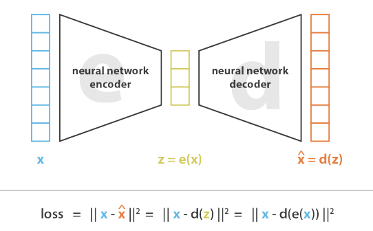

<!--
_header: ''
_footer:  Esta obra está bajo una [licencia de Creative Commons Reconocimiento-NoComercial-CompartirIgual 4.0 Internacional](http://creativecommons.org/licenses/by-nc-sa/4.0/). Icono diseñado por Flaticon
-->

# Aprendizaje por refuerzo y técnicas generativas.

Deep Q Network (DQN)

---

<!-- _class: section -->
# Introducción a los modelos Generativos

---

# Introducción

Tradicionalmente existen dos paradigmas de aprendizaje y distintos tipos de modelos, como son el aprendizaje ***Supervisado*** y ***No Supervisado***

     

---

# Introducción

A su vez, existen diferentes modelos o diferentes problemas (paradigmas) que afrontar con los modelos de IA:

- **Discriminativos**: predicen la probabilidad de pertenecer a una clase dado las carácterísticas de los datos de entrada.
- **Generativos**: buscan modelar cómo se generan los datos observados y pueden generar nuevos datos similares

     

---

# Introducción - paradigmas de los modelos generativos

- No solo aprenden a diferenciar, sino que aprenden la estructura de los datos
- Son útiles en aprendizaje no supervisado
- Es más sencillo obtener una idea de qué caracteriza una clase
- Son más costosos computacionalemente

---

# Introducción - paradigmas de los modelos generativos

Ejemplos y evolución de los modelos generativos:
- Naive Bayes (1960~1970)
- Máquinas de Boltzmann (RBM) (1980)
- Modelos de Markov (HMM) (1960~1970)
- Gaussian Mixture Models (GMMs) (1977)
- Autoencoders variacionales (AEs) (2013)
- Generative Adversarial Networks (GANs) (2014)
- Transformers (2017)
- Diffusion Models (2020)

---

<!-- _class: section -->
# Autoencoders - AEs

---

# ¿Qué son los Autoencoders?

Un tipo de red neuronal que puede aprender a comprimir y luego reconstruir datos.
- Un autoencoder es un tipo de red neuronal utilizada en tareas de **aprendizaje no supervisado**.
- Su objetivo es aprender una **representación compacta** de los datos de entrada.
- Consiste en dos partes principales: el ***codificador*** y el ***decodificador***.
- El objetivo principal de un autoencoder es ***minimizar la diferencia*** entre los datos de entrada y los datos reconstruidos por el decodificador. 

---

# ¿Qué son los Autoencoders?

Son redes neuronales con una arquitectura compuesta de dos componentes que se entrenan al mismo tiempo:
- **Codificador**: Transforma los datos de entrada en una representación de menor dimensión.
- **Decodificador**: Toma esta representación y reconstruye los datos originales.

     

---

# Areas de aplicación

Son muy útiles en una amplia variedad de aplicaciones.
- **Reducción de dimensionalidad**: aprender representaciones comprimidas de datos de alta dimensionalidad, lo que permite reducir el número de características necesarias para describir los datos. 
- **Eliminación de ruido**: Al entrenar con datos ruidosos y luego reconstruirlos, se pueden obtener versiones limpias y filtradas de los mismos.
- **Detección de anomalías**: modelar la distribución de los datos normales y detectar desviaciones significativas como anomalías. (detección de fraudes, fallas en equipos, etc.)
- **Generación de datos**: Al muestrear del espacio latente, los autoencoders pueden generar nuevas muestras de ***datos similares*** a los ejemplos de entrenamiento.

[Ian Goodfellow](https://scholar.google.es/citations?hl=es&user=iYN86KEAAAAJ) menciona que son la primera red generativa.

---

# Arquitectura Convolutional Autoencoder

     

Imagen obtenida de [Deep Clustering with Convolutional Autoencoders](https://www.researchgate.net/publication/320658590_Deep_Clustering_with_Convolutional_Autoencoders)

---

# Entrenamiento Semi-supervisado

El entrenamiento es exactamente igual que cualquier red neuronal, la diferencia radica en qué se utiliza como **"etiquetas"**.
- La ***función de pérdida*** se calcula comparando la salida obtenida (imagen reconstruida) con los datos que se espera obtener (imagen sin ruido, etc)
- La razón principal por la que se considera **"semisupervisado"** es que el proceso de entrenamiento no requiere etiquetas explícitas (gato, perro, etc).

     

«Que no os vendan la moto, es un entrenamiento supervisado », Edgar Talavera.

---

<!-- _class: section -->
# Variational Autoencoders

---

# Motivación

Los **Autoencoders** tienen un gran problema: no son buenos generadores de datos.

<b>¿Por qué?</b>

Pensemos en un ejemplo sencillo: la reconstrucción de imágenes del dataset MNIST.

<b>¿Cómo pensáis que será el espacio latente?</b>

---

# Motivación

     

---

# Motivación

Al **no ser una distribución de datos continua**, tendremos problemas cuando la entrada sea ligeramente distinta a los datos con los que se entrenó el autoencoder:

     

¿Qué ocurrirá cuando la entrada sean imágenes que generen espacios latentes entre medio de las muestras de entrenamiento?

---

# Motivación

- **Espacios continuos**: En un espacio continuo, los datos pueden tomar un rango infinito de valores dentro de un intervalo determinado.
- **Espacios discretos**: En un espacio discreto, los datos solo pueden tomar un conjunto finito o contablemente infinito de valores distintos.

     

---

# Motivación
La mejor situación que buscamos es conseguir:
- Un espacio latente **continuo** y **ordenado**
- En el espacio ordenado permite tener las muestras similares agrupadas
- No se pierde la capacidad de interpolar entre diferentes muestras

     

---

# Motivación - ¿Cómo lo conseguimos?
- Solo podemos forzar a la propia red a que ordene el espacio latente
- ¿Cómo?
- Durante el entrenamiento, se minimiza una función de perdida 
- ¿Y...?
- Pués ahí es donde vamos a trabajar, pero entonces ya no usamos un Autoencoder...

     

---

# Variational Autoencoders (VAEs)

Son una variante de los autoencoders que buscan la generación de datos sintéticos.
- Combinan redes neuronales con distribuciones de probabilidad.
- Permiten que los datos generados sigan el mismo patrón que los datos de entrada.
  
Así, la red aprende los parámetros de una distribución de probabilidad.
- Construyen explícitamente un ***espacio latente continuo*** y ***ordenado***.
- No una función arbitraria como en las redes neuronales convencionales.

---

# Variational Autoencoders (VAEs)

El espacio latente está definido por **dos vectores** de tamaño n:

     

Luego debemos ajustar las funciones de pérdida individualmente de tal manera que:
- Una ***función de pérdida tradicional*** que calcula la diferencia con el objeto generado.
- La ***divergencia KL*** (Kullback-Leibler) entre la distribución latente aprendida y la distribución anterior (prior distribution), que actúa como término de regularización.

---

# KL-divergence

¿Por qué necesitamos las pérdidas de reconstrucción y la divergencia KL?

     

---

# KL-divergence

La ***funcion KL-divergence*** mide la diferencia entre dos distribuciones de probabilidad.

     

$D_{\text{KL}}(P \parallel Q) = \sum_{i} p_i \log\left(\frac{p_i}{q_i}\right)$

Donde:
- \( $p_i$ \) es la probabilidad de la categoría \( $i$ \) en la distribución \( $P$ \).
- \( $q_i$ \) es la probabilidad de la categoría \( $i$ \) en la distribución \( $Q$ \).

Aplicada en el contexto de Variational Autoencoders (VAEs) es:

$D_{\text{KL}}(P(z) \parallel Q(z)) = \frac{1}{2} \sum_{i=1}^{K} \left( \sigma_i^2 + \mu_i^2 - 1 - \log(\sigma_i^2) \right)$

Donde:
- \( $K$ \) es la dimensionalidad del espacio latente.
- \( $\mu_i$ \) y \( $\sigma_i$ \) son la media y la desviación estándar de la distribución \( $P(z)$ \) en la dimensión \( $i$ \) del espacio latente.
  
---

<!-- _class: section -->
# I now call it “self-supervised learning”, because “unsupervised” is both a loaded and confusing term. […] Self-supervised learning uses way more supervisory signals than supervised learning, and enormously more than reinforcement learning. That’s why calling it “unsupervised” is totally misleading. 
Yann LeCun - Recent Advances in Deep Learning (2019)

---

# Bonus: ¿Aprendizaje supervisado o no supervisado?

Tradicionalmente, se han clasificado como ***aprendizaje no supervisado***.
- Después de todo, no trabajan con datos *etiquetados*.
- ¡Pero no puedes optimizar autoencoders sin la retroalimentación de la propia reconstrucción!
  
En el ***aprendizaje supervisado***, se aprende con retroalimentación de los datos.
- Se espera que, al proporcionar algunos ejemplos, el algoritmo descubra la función
que mapea las entradas a las salidas deseadas con el menor error.

Yann LeCun inventó el término ***aprendizaje auto-supervisado*** para hablar sobre estos
modelos.

---
# Recursos didácticos

1. [Reducing the dimensionality of data with neural networks.
science, 313(5786):504–507, 2006](https://www.science.org/doi/10.1126/science.1127647)
2. [Extracting and composing robust features with denoising autoencoders, 2008.](https://www.cs.toronto.edu/~larocheh/publications/icml-2008-denoising-autoencoders.pdf)
3. [Semi-Supervised Recurrent Variational Autoencoder Approach for Visual Diagnosis of Atrial Fibrillation](https://www.researchgate.net/publication/349939162_Semi-Supervised_Recurrent_Variational_Autoencoder_Approach_for_Visual_Diagnosis_of_Atrial_Fibrillation)
4. [Variational Autoencoders, Radboud University](https://indico.ictp.it/event/8674/session/155/contribution/1121/material/slides/0.pdf)

